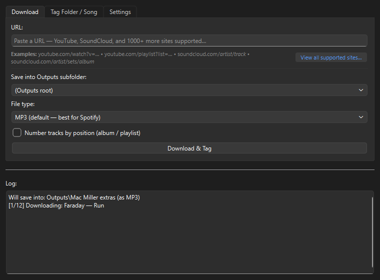
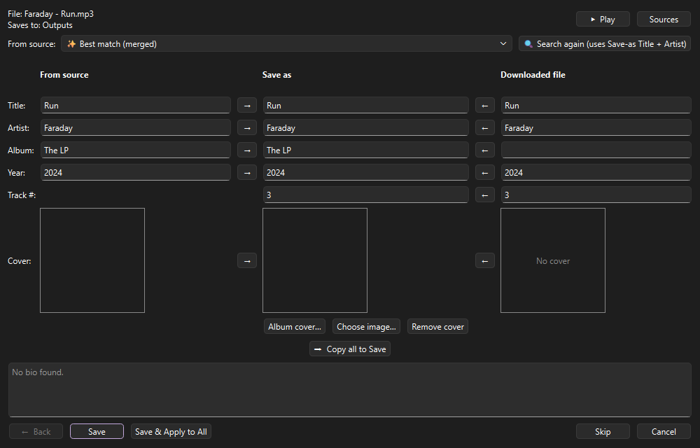
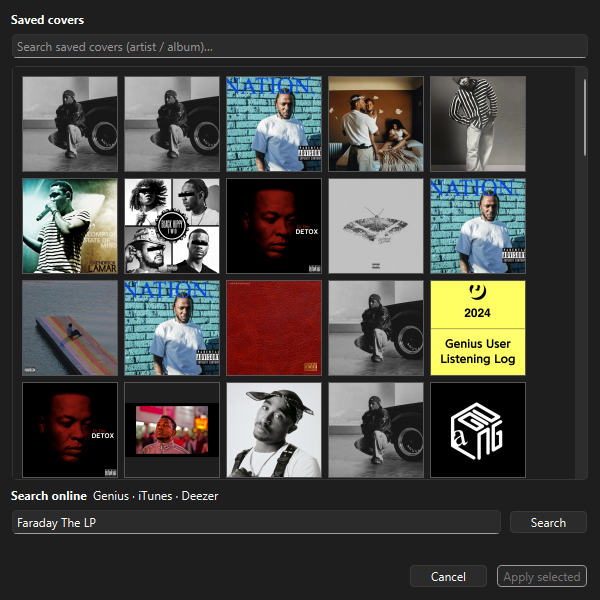
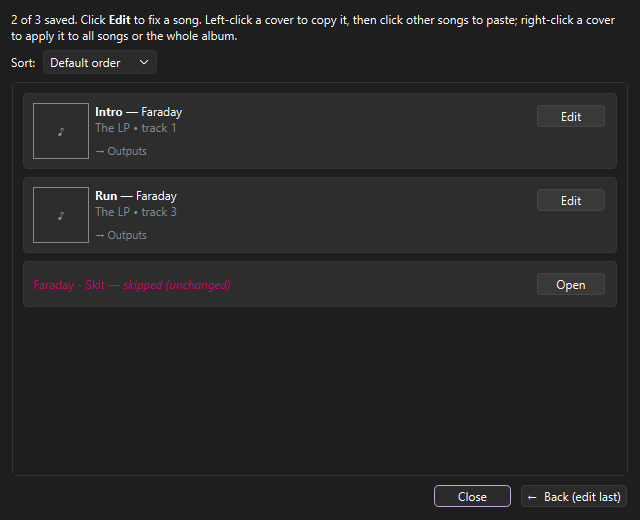
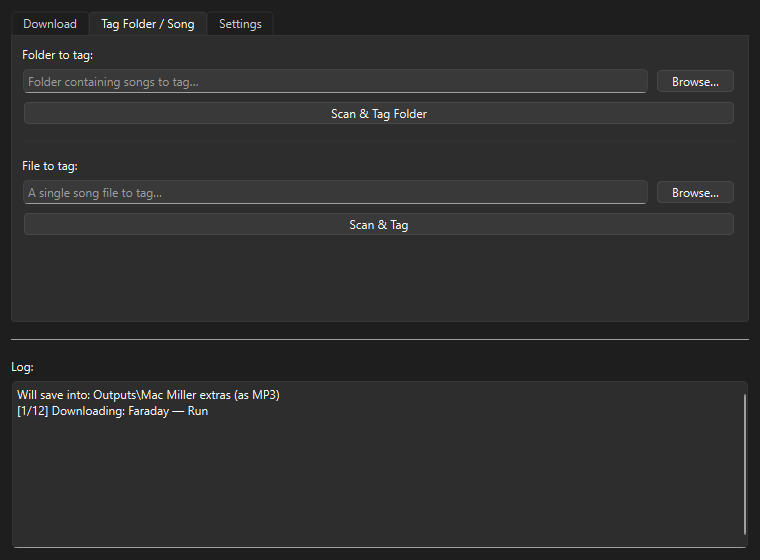

# Local Filer

A desktop app (PySide6) for building a clean local music library — especially of
**unreleased / leaked tracks**. Paste a link to download audio from YouTube,
SoundCloud and 1000+ other sites (using [yt-dlp](https://github.com/yt-dlp/yt-dlp)), or point it at songs you already have. Local
Filer looks up metadata + album art from several sources, lets you preview them, and writes proper tags into the files, so they look right for your music app of choice.

> Run it: `Run Local Filer.bat` (or `.\.venv\Scripts\python.exe -m localfiler.main`).

---

## A tour

### Download & tag



Paste a track, playlist or album URL (YouTube, SoundCloud, … — 1000+ sites via
yt-dlp), or **drag & drop** a URL onto the tab. Choose **MP3**, **M4A**, or
**native** (no re‑encode); optionally **number tracks** by position for
albums/playlists. The file lands in `Downloads/`, opens in the preview, and Save
moves it into the Outputs subfolder you chose.

### Preview — full control over every field



Three columns: **From source** (best‑match merge, or any individual provider via
the dropdown) → **Save as** (what actually gets written — fully editable) → the
file's own data (**Downloaded file** for a download, **Original (file)** for a
song you're re‑tagging). The `→` / `←` buttons copy a single field across, or
**Copy all**. Save‑as starts from the file's own data and only fills the *gaps*
from the best match.

- **▶ Play / ⏹ Stop** — listen to the track; stops when you Save/Skip/Back/close.
- **Sources** — see which providers matched, were skipped, or errored (with links).
- **Album cover… / Choose image… / Remove cover** — see below.
- **Save · Save & Apply to All · Skip · Cancel · ← Back** — Apply‑to‑All tags the
  rest of the batch exactly as a manual click‑through would.

### Album covers



The **Album cover…** button opens a picker: the top is a searchable gallery of
every cover you've already saved; underneath, an online search
across **Genius + iTunes + Deezer** shows three previews (hover for the album
title).

### Batch recap — review, fix, and unify covers



After a bulk job you get a recap of every song with the tags and cover that were
written. **Edit** re‑opens any song's preview; skipped downloads show **Open**. And to
give several songs the same album art: **left‑click a cover to copy it, then
click other songs to paste**, or **right‑click a cover → apply to all songs /
apply to this album**.

### Tag a folder or a single song



Point it at music you already have — a whole folder or a single file (or **drag &
drop** one onto the tab) — to pull metadata and write tags in place. Folders run
the fast parallel scan above; single songs go straight to the preview.

---

## How it works

**Two flows:**

- **Download** → the file lands in `Downloads/` → preview → Save moves it into the
  Outputs subfolder you chose. Skipping/cancelling discards the download.
- **Tag Folder / Song** → reads the existing file(s), shows their current tags in
  the **Original** column, and saves in place.

**Metadata** comes from `Genius → iTunes → Deezer → MusicBrainz`, plus the
download platform itself (or a YouTube search when tagging existing files). Each
field is filled from the highest‑priority source that has it; the providers run
concurrently for speed.

**Covers** are cached in `Covers/`. YouTube thumbnails are embedded but not cached.

**Working folders** (created next to the app): `Downloads/` (transient),
`Outputs/` (your library — organised into subfolders), `Covers/` (cover cache).

---

## Setup

First run does it for you. Local Filer needs 3 external tools: `yt-dlp.exe` (downloading) and `ffmpeg.exe` + `ffprobe.exe` (audio conversion).
On a fresh copy the app detects what's missing and runs a setup
that downloads them. If a binary ever goes missing later, that same setup runs again on the
next launch. `yt-dlp.exe` can self‑update from **Settings → Updates** if a site
stops working.

A **Genius API token** is required (free) — set it in **Settings**

Run from source — install the dependencies (listed in `requirements.txt`), then
launch:

```
python -m localfiler.main
```

---

## Packaging (PyInstaller)


1. Install the dependencies + PyInstaller:

   ```
   pip install -r requirements.txt
   pip install pyinstaller
   ```
2. Build **onedir** (keeps the binaries external so `yt-dlp.exe -U` can
   self-update), from `app.py` — **not** `localfiler/main.py`:

   ```
   pyinstaller --noconfirm --windowed --onedir --name "Local Filer" app.py
   ```

Keep it out of `C:\Program Files` so first‑run setup, `yt-dlp.exe -U`, and the
working folders stay writable.

---

## Project layout

```
localfiler/
  config.py            paths + settings
  models.py            ProviderResult / SongMetadata / …
  core/
    downloader.py      wraps yt-dlp.exe
    setup.py           first-run/repair: fetch yt-dlp + ffmpeg/ffprobe
    covers.py          cover download + cache (URL-keyed)
    tagging.py         read/write tags (MP3, M4A, FLAC, Opus, Ogg)
    metadata/          genius · itunes · deezer · musicbrainz · source(youtube)
                       aggregator.gather() · cover_search
  gui/
    main_window.py     the three tabs
    preview_dialog.py  the 3-column preview + Play + Album cover
    cover_picker_dialog.py  saved-covers gallery + online search
    setup_dialog.py    first-run/repair download UI (smooth progress)
    recap_dialog.py    end-of-batch recap + cover copy/paste
    scan_progress_dialog.py  live parallel-scan view
    worker.py          background QThreads
```
